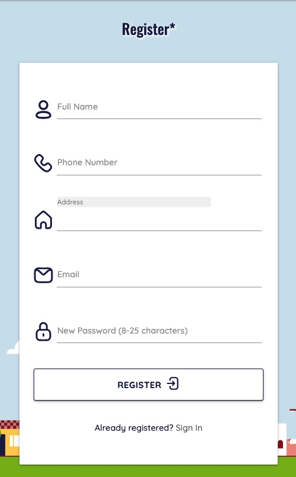
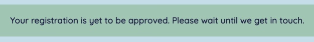
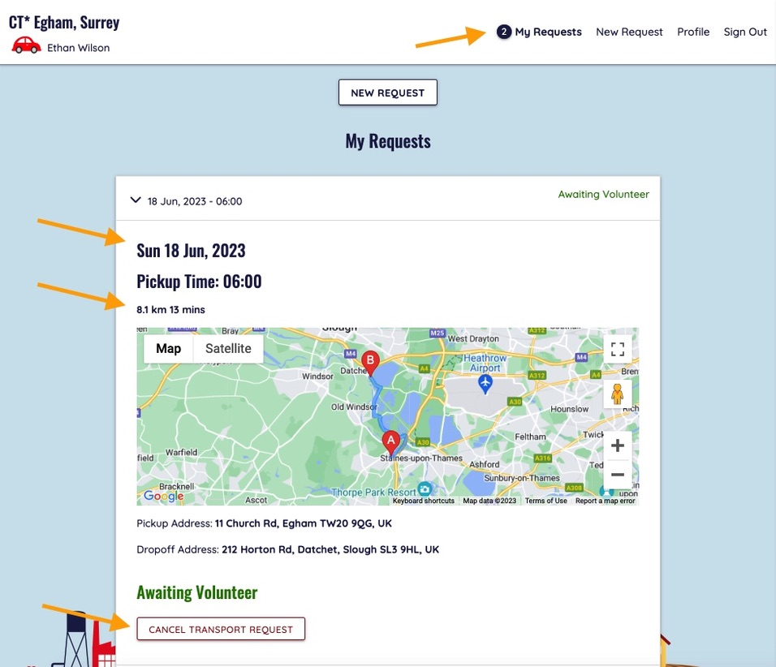

# Community Transport

Full stack web application to support the local community of Egham, UK. The app allows volunteers to sign up to offer transport to essential places such as hospitals or GP Practices. People who need such help can also sign up and request lifts. It is the Admin(s) responsibility to do background checks before they approve anybody who joins to ensure everybody's safety.

---

### [View the live project here](https://community-transport-egham.herokuapp.com/)
---

> This project was created for [Code Institute](www.codeintitute.net)'s Web Development Course as the Third Milestone Project (MS3) - Data Centric Fullstack Development Project - for assessment purposes.
  
Not for public use.
  
&copy; 2023 Szilvia Csernusne Berczes. All rights reserved.

---
 

# User Experience (UX)

## Site Owner's Goals

* Provide a platform for people willing to take part in this initiative. Users should include admins, volunteers as well as people requiring transport.
* Allow signing up as someone seeking help in the local area.
* Allow signing up as a potential volunteer.
* Let admin(s) control who can be accepted to join and manage all their data.
* Provide authentication of users.
* The site should serve all types of users' goals: admins, volunteers and members.
* The site should be easily accessible from a variety of devices.
  

## Admin's Goals

As an admin, I would like to

* be able to register and safely sign in.
* have control over accepting / declining users who register.
* have a record of each individual.
* be able to edit the relevant records of any user.
* be able to delete any user from the database.
* be able to grant admin / volunteer privilages to other users.
* be able to take away admin / volunteer privilages from other users.
* have an overview of all current and past transport requests.
* be able to delete my own record without a trace.
  

## Member's Goals

As a member, I would like to

* be able to register and safely sign in.
* be able to edit my own data.
* be able to request a new transport.
* be able to see my current / past transport requests.
* know if a volunteer offered transport to any of my requests.
* have an overview of all of my own requests.
* be able to cancel any of my current requests.
* be able to clear any of my past requests.
* be able to delete my own record without a trace.
  

## Volunteer's Goals

As a volunteer, I would like to

* be able to register and safely sign in.
* be able to edit my own data.
* be able to view all current outstanding transport requests.
* be able to accept a transport request.
* have an overview of all of the trips I previously accepted.
* be able to cancel any current trips I previously accepted.
* be able to delete my own record without a trace.

  

# Wireframes
 

Wireframes were created in [Balsamiq](https://balsamiq.cloud/).  

 
 
 
 
 
  

## Colour Scheme

Colour Palette was created using [Figma](https://www.figma.com/).

The colours were sampled from the background image. Dark red was used for admin pages and delete buttons, green was used for volunteer pages as well as volunteer actions. The general font colour is dark blue. All font colours were tested for contrast against their backgrounds.

  

## Typography

I used two fonts, [Oswald](https://fonts.google.com/specimen/Oswald) and [Quicksand](https://fonts.google.com/specimen/Quicksand) from the [Google Fonts](https://fonts.google.com/) library. I selected them because I felt that they complement each other and their styles are fitting the scheme.
  

## Imagery

The main background image was downloaded from [freesvg.org](https://freesvg.org/cityscape-cartoon-illustration).

The icons were downloaded from [svgrepo](https://svgrepo.com/). Credits to individual icons are given in the [credits](#credits) section.  
For **favicons**, I created a small logo in [Figma](https://www.figma.com/) and used the [RealFaviconGenerator](https://realfavicongenerator.net/svg-favicon/) to convert it to favicons.

  

# Database

Four tables were used to model the data and its relationships.

 

[Schema Link (accessible for LucidChart users)](https://lucid.app/lucidchart/55d32dd7-0602-401b-8492-4d5bce45d4cb/edit?viewport_loc=-34%2C-1175%2C2263%2C1092%2C0_0&invitationId=inv_b0df2289-d582-4b8f-8740-c7cafb034218)

# Functionality

## Landing Page

The landing page gives a small intro about the organisation's mission and ways to sign up as a volunteer or as someone seeking help. 

### Features

* I animated the background image and the red car in the front in CSS to give the impression of the car moving forward. 
* I drew the red car in [Figma](https://www.figma.com/) by copying this [free image](https://www.cleanpng.com/png-car-ferrari-f50-honda-civic-clip-art-red-car-clipa-178920/download-png.html). I needed to separate the car's body from its wheels in order to animate them separately.
* The responsible navbar is a [Materialize](https://materializecss.com/) feature.
* The background picture is downloaded from [freesvg.org](https://freesvg.org/cityscape-cartoon-illustration) 

  

## Registration

People can register for this project by filling in a registration form. However, submitting the form does not give automatic access to the site - an admin is required to approve everyone.

### Features

* I used the [Google Maps API](https://developers.google.com/maps)'s Autocomplete service in JavaScript to validate the address input. The user has to choose an address from the suggested list otherwise it gives an error message. I also restricted the available addresses to Egham and its neighbouring areas.
* I validate the password in JavaScript with a `regular expression`, requiring the user to include certain types of characters. An error message notifies the user if the requirements haven't been met.
* Basic HTML validation is used for
    - the length of the name, phone, email and password.
    - email's format
* After submission, the email's uniqueness is verified.

 

After Successfully submitting the form, the user receives a flash notification:

 

If the email was already registered, it gives a feedback:

 

  

## Sign in

Without an admin's approval, a newly registered person can't sign in, they get a notification if they try to:
 

After having been approved, a registered person can sign in.

 

If the email or password was incorrect, user gets an error:

 

Otherwise, the user gets logged in and is greeted with a welcome message:

 

  

## New Request

The new transport request form is pre-populated with the user's home address for convenience, but it also can be changed if the pickup address is different. Both addresses need to be Google-verified addresses, with the same validation process as for the registration form. The date input is restricted to the next 3 months.

 

The date- and time inputs are Materialize features:

 

Upon submission, I validate all input again with JavaScript. I restricted Materialize's date picker to the next three months but I validate all input once again to make sure the user didn't entered any wrong data manually.

 

If all data is valid, the request gets registered and the user receives a feedback:

 

  

## My Requests 

The user can keep track of their requests in the `My Requests` page.

Here, we can see Ethan's newly registered requests. The first request opens automatically and a map shows the route of the requested trip. It calculates the distance and the approx. time of travel. There is an option to Cancel this request too.

 

If a volunteer accepts this request, the state of the request changes to `Arranged` and the volunteer's contact details will be visible on the page.

 

  

## Outstanding Requests and Arranged Trips (seen by volunteers)

Volunteers can see all upcoming requests that nobody volunteered for yet in the `Outstanding Requests` tab. The first such request is provided with a map and a route as well as all details necessary. With the `Accept Transport Request` button, the volunteer can take on this transport.

After accepting a request, the user will be taken to the `Trips` page, where they can keep track all of their upcoming trips they have volunteered for.

The volunteer can cancel the trip anytime, in which case another volunteer can still pick up the request. However, if the cancellation time is within 24 hours of the pickup time, they get a notification to get in touch with this individual personally.

 

  

## All Members (seen by admins)

If an admin logs in, they are taken to the admin's platform. One of the admin functions is `All Users`: an admin can see, approve, edit and delete any user. They can grant and take away admin privilages as well as volunteer roles.

Approval

Any Admin can approve a new person. They can review the request by contacting this person and having checks carried out before they approve them in the system.
If there are new people awaiting approval, they appear under the `All Users` tab.
The platform gives indications about how many new people there are as well as if they signed up as a volunteer or just as a simple member.

 

Superuser is the first admin to the site. It can give admin privilages to others that have all the same rights as the Superuser except that Superuser can't be deleted or its admin status taken away. This is to ensure that one cannot accidentally delete all admins from the site.

 

  

## All Requests (seen by admins)

The other main admin function is monitoring all transport requests under the `All Requests` tab. After successful login, this is the page where the admin is directed to. The page lists all upcoming and past requests, ordered by their pickup dates and times. The map shows all current requests' pickup places with clustered map markers, centered around the first request.
 

  

## Profile Page / Edit Profile

 

  

## Error pages

Two types of error messages can be delivered to the user depending on the issue 
* a `404 (not found) page` in case of an invalid URL was typed in or
* a `500 (internal server error)` in case there is a problem with code execution or with the connection to the server. 
 

  

  

## Future Implementations

* Email Confirmation and 'Forgot Password?' functionality

* Automated testing.

  

---

## Accessibility
 

* Images have `alt` labels and other icons with inferred meanings are marked with `aria` labels.
* For font sizes, `rem` was used throughout the site to allow the text to scale according to the users' preferred default font size.

* Chrome Dev Tools' Lighthouse score is 100% for accessibility for both mobile and desktop devices. 

  

---

# Technologies Used
 

## Languages Used
 

The site was built with [Python], [PosgreSQL], [JavaScript](https://en.wikipedia.org/wiki/JavaScript), [HTML](https://en.wikipedia.org/wiki/HTML5) and [CSS](https://en.wikipedia.org/wiki/CSS).
  

## Frameworks, Libraries, APIs & Programs Used
 

* [Flask]() - Fullstack framework

* [SQLAlchemy]() - Object Relational Model to the ProsgreSQL database

* [jinja2]() - to include python code into HTML

* [Materialize](https://materializecss.com/) - Navbar, Collapsible, Form, Data and Time pickers.

* [Google Maps API](https://developers.google.com/maps) - Autocompletion, Direction, Geocoding, ClusterMarker and Map.

* [Google Fonts](https://fonts.google.com/)  - for texts.

* [Balsamiq](https://balsamiq.cloud/)  - to create wireframes.

* [Figma](https://www.figma.com/)  - to create colour palette and image for favicons.

* [RealFaviconGenerator](https://realfavicongenerator.net/svg-favicon/)  - to generate favicons.

* [Multi Device Website Mockup](https://techsini.com/multi-mockup/index.php)  - to create site visuals for responsive design.

* [Gyazo](https://gyazo.com)  - for adding `.gif` files to this README file.

* [Git](https://git-scm.com/) & [Github](https://github.com/)  - for version control, safe storage and deployment.

* [Google Dev Tools](https://developer.chrome.com/docs/devtools/)  - for testing and troubleshooting.

* [Lucid App](https://lucid.app) - for database model visuals.

* [Random Key Generator](https://randomkeygen.com/) - to generate a secret key.

* [Geolocation coordinate finder](http://bboxfinder.com/) - to define the boundary box around Egham.

---

## Deployment

* [Heroku]() -
* [ElephantSQL]() - 

  

# Testing

Detailed testing processes are documented in [TESTING.md](TESTING.md).

---
  

# Credits

 

## Imagery
 

* background image - PD (Public Domain) Licence 
https://freesvg.org/cityscape-cartoon-illustration

* logout svg icon
https://www.svgrepo.com/svg/499618/logout - PD (Public Domain) Licence

* user icon
https://www.svgrepo.com/svg/499663/user - PD (Public Domain) Licence

* calendar icon
https://www.svgrepo.com/svg/499578/calendar - PD (Public Domain) Licence

* house icon
https://www.svgrepo.com/svg/499611/home - PD (Public Domain) Licence

* location icon
https://www.svgrepo.com/svg/499616/location - PD (Public Domain) Licence

* phone icon
https://www.svgrepo.com/svg/499633/phone - PD (Public Domain) Licence

* mail icon
https://www.svgrepo.com/svg/499621/mail - PD (Public Domain) Licence

* edit icon
https://www.svgrepo.com/svg/499600/edit - PD (Public Domain) Licence

* user-remove icon
https://www.svgrepo.com/svg/499667/user-remove - PD (Public Domain) Licence

* lock icon
https://www.svgrepo.com/svg/499617/lock - PD (Public Domain) Licence

* clock icon
https://www.svgrepo.com/svg/499655/time - PD (Public Domain) Licence

* login icon
https://www.svgrepo.com/svg/499619/login - PD (Public Domain) Licence

* burger icon
https://www.svgrepo.com/svg/499620/menu-burger - PD (Public Domain) Licence

* caret down
https://www.svgrepo.com/svg/499575/chevron-down - PD (Public Domain) Licence

  

## Incorporated ideas and solutions
 

* user login model (used as a starter code)
https://github.com/Code-Institute-Solutions/CombinedTaskManager2022/tree/main

* password validation regex (used as a starter code)
https://stackoverflow.com/questions/19605150/regex-for-password-must-contain-at-least-eight-characters-at-least-one-number-a

* red car icon (own drawing after this picture)
https://www.cleanpng.com/png-car-ferrari-f50-honda-civic-clip-art-red-car-clipa-178920/download-png.html

* animation inspiration:
https://developer.mozilla.org/en-US/docs/Web/CSS/transform
https://developer.mozilla.org/en-US/docs/Web/CSS/animation

  

##  Acknowledgements
 
I would like to thank the following contributors:

* [Manuel Perez Romero](https://www.linkedin.com/in/manuel-perez-romero-460063176/) and [Elaine Broche](https://github.com/elainebroche-dev) for giving useful feedback throughout the development and testing processes.

* My family and friends for taking the time to test the site.

* [Code Institute](www.codeintitute.net)'s Slack Community for continuous support.

  

##  Disclaimer
 

This project was created for Code Institute's web application development course as the Third Milestone Project - Data Centric Fullstack Development Project - for assessment purposes. All parts of the project form the intellectual property of the developer.
  
Not for public use.
  
&copy;2023 Szilvia Csernusne Berczes. All rights reserved. 