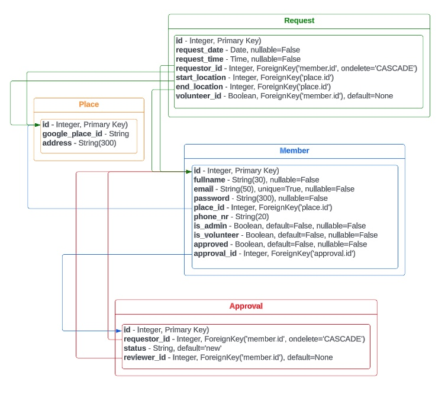

# Community Transport

Full stack web application to support the local community of Egham, UK. The app allows volunteers to sign up to offer transport to essential places such as hospitals or GP Practices. People who need such help can also sign up and request lifts. It is the Admin(s) responsibility to do background checks before they approve anybody who joins this initiative to ensure everybody's safety.

---

## [View the live project here](https://community-transport-egham.herokuapp.com/)
---

> This project was created for [Code Institute](www.codeintitute.net)'s Web Development Course as the Third Milestone Project (MS3) - Data Centric Fullstack Development Project - for assessment purposes.
  
Not for public use.
  
&copy; 2023 Szilvia Csernusne Berczes. All rights reserved.

---
 

# User Experience (UX)

## Site Owner's Goals

* 

## Players' Goals

* 

 

# Wireframes
 

Wireframes were created in [Balsamiq](https://balsamiq.cloud/).  

 

  

## Colour Scheme

  

## Typography

I used two fonts, [Oswald](https://fonts.google.com/specimen/Oswald) and [Quicksand](https://fonts.google.com/specimen/Quicksand) from the [Google Fonts](https://fonts.google.com/) library. I selected them because I felt that they complement each other and their styles are fitting the scheme.
  

## Icons

The icons are either linked to the FontAwesome library or were downloaded from [svgrepo](https://svgrepo.com/). Credits to individual icons are given in the [credits](#credits) section.  
For **favicons**, I created a small logo in [Figma](https://www.figma.com/) and used the [RealFaviconGenerator](https://realfavicongenerator.net/svg-favicon/) to convert it to favicons.

  

# Database

Four tables were used to model the data and its relationships.

 

Schema Link (by LucidChart - accessible for LucidChart users)
https://lucid.app/lucidchart/55d32dd7-0602-401b-8492-4d5bce45d4cb/edit?viewport_loc=-34%2C-1175%2C2263%2C1092%2C0_0&invitationId=inv_b0df2289-d582-4b8f-8740-c7cafb034218

# Functionality

## Landing Page

  

## Register

 

  

## Login

 

  

## Profile Page

 

  

## Edit Profile

 

  

## New Request

 

  

## My Requests 

 

  

## Outstanding Requests (seen by volunteers)

 

  

## My Trips (seen by volunteers)

 

  

## All Members (seen by admins)

 

  

## All Requests (seen by admins)

 

  

## Error pages

Two types of error messages can be delivered to the user depending on the issue 
* a `404 (not found) page` in case of an invalid URL was typed in or
* a `500 (internal server error)` in case there is a problem with code execution or with the connection to the server. 
 

  

  

## Future Implementations

* Email Confirmation and 'Forgot Password?' functionality

* Automatic testing.

  

---

## Accessibility
 

* Images have `alt` labels and other icons with inferred meanings are marked with `aria` labels.
* For font sizes, `rem` was used throughout the site to allow the text to scale according to the users' preferred default font size.

* Chrome Dev Tools' Lighthouse score is 100% for accessibility for both mobile and desktop devices. 

  

---

# Technologies Used
 

## Languages Used
 

The site was built with [Python], [PosgreSQL], [JavaScript](https://en.wikipedia.org/wiki/JavaScript), [HTML](https://en.wikipedia.org/wiki/HTML5) and [CSS](https://en.wikipedia.org/wiki/CSS).
  

## Frameworks, Libraries & Programs Used
 

* [Flask]() - Fullstack framework

* [SQLAlchemy]() - Object Relational Model to the ProsgreSQL database

* [jinja2]() - to include python code into HTML

* [Materialize](https://materializecss.com/) - Navbar, Collapsible, Form, Data and Time pickers.

* [Google Maps API]() - Autocompletion, Direction, Geocoding, ClusterMarker and Map.

* [Google Fonts](https://fonts.google.com/)  - for texts.

* [Balsamiq](https://balsamiq.cloud/)  - to create wireframes.

* [Figma](https://www.figma.com/)  - to create colour palette and image for favicons.

* [RealFaviconGenerator](https://realfavicongenerator.net/svg-favicon/)  - to generate favicons.

* [Multi Device Website Mockup](https://techsini.com/multi-mockup/index.php)  - to create site visuals for responsive design.

* [Gyazo](https://gyazo.com)  - for adding `.gif` files to this README file.

* [Git](https://git-scm.com/) & [Github](https://github.com/)  - for version control, safe storage and deployment.

* [Google Dev Tools](https://developer.chrome.com/docs/devtools/)  - for testing and troubleshooting.

* [Lucid App](https://lucid.app)

* [FontAwesome](https://fontawesome.com/)

* [Random Key Generator](https://randomkeygen.com/)

* [Geolocation coordinate finder](http://bboxfinder.com/)

---

## Deployment

* [Heroku]() -
* [ElephantSQL]() - 

  

# Testing

Detailed testing processes are documented in [TESTING.md](TESTING.md).

---
  

# Credits

 

## Icons
 

* logout svg icon
https://www.svgrepo.com/svg/499618/logout - PD licence (Public Domain)

* user icon
https://www.svgrepo.com/svg/499663/user

* calendar icon
https://www.svgrepo.com/svg/499578/calendar

* house icon
https://www.svgrepo.com/svg/499611/home

* location icon
https://www.svgrepo.com/svg/499616/location

* phone icon
https://www.svgrepo.com/svg/499633/phone

* mail icon
https://www.svgrepo.com/svg/499621/mail

* edit icon
https://www.svgrepo.com/svg/499600/edit

* user-remove icon
https://www.svgrepo.com/svg/499667/user-remove

* lock icon
https://www.svgrepo.com/svg/499617/lock

* clock icon
https://www.svgrepo.com/svg/499655/time

* login icon
https://www.svgrepo.com/svg/499619/login

  

## Other credits - incorporated ideas and solutions
 

* user login model
https://github.com/Code-Institute-Solutions/CombinedTaskManager2022/tree/main

* password validation regex:
https://stackoverflow.com/questions/19605150/regex-for-password-must-contain-at-least-eight-characters-at-least-one-number-a

* red car icon (own drawing after this picture)
https://www.cleanpng.com/png-car-ferrari-f50-honda-civic-clip-art-red-car-clipa-178920/download-png.html

* animation inspiration:
https://developer.mozilla.org/en-US/docs/Web/CSS/transform
https://developer.mozilla.org/en-US/docs/Web/CSS/animation

  

##  Acknowledgements
 
I would like to thank the following contributors:

* [Manuel Perez Romero](https://www.linkedin.com/in/manuel-perez-romero-460063176/) and [Elaine Broche](https://github.com/elainebroche-dev) for giving useful feedback throughout the development and testing processes.

* My family and friends for taking the time to test the game.

* [Code Institute](www.codeintitute.net)'s Slack Community for continuous support.

  

## Tools used:

## Credits

Schema Link (by LucidChart - accessible for LucidChart users)
https://lucid.app/lucidchart/55d32dd7-0602-401b-8492-4d5bce45d4cb/edit?viewport_loc=-34%2C-1175%2C2263%2C1092%2C0_0&invitationId=inv_b0df2289-d582-4b8f-8740-c7cafb034218

background picture

Bugs
Address label on google address autocomplete fields

##  Disclaimer
 

This project was created for Code Institute's web application development course as the Third Milestone Project - Data Centric Fullstack Development Project - for assessment purposes. All parts of the project form the intellectual property of the developer.
  
Not for public use.
  
&copy;2023 Szilvia Csernusne Berczes. All rights reserved. 