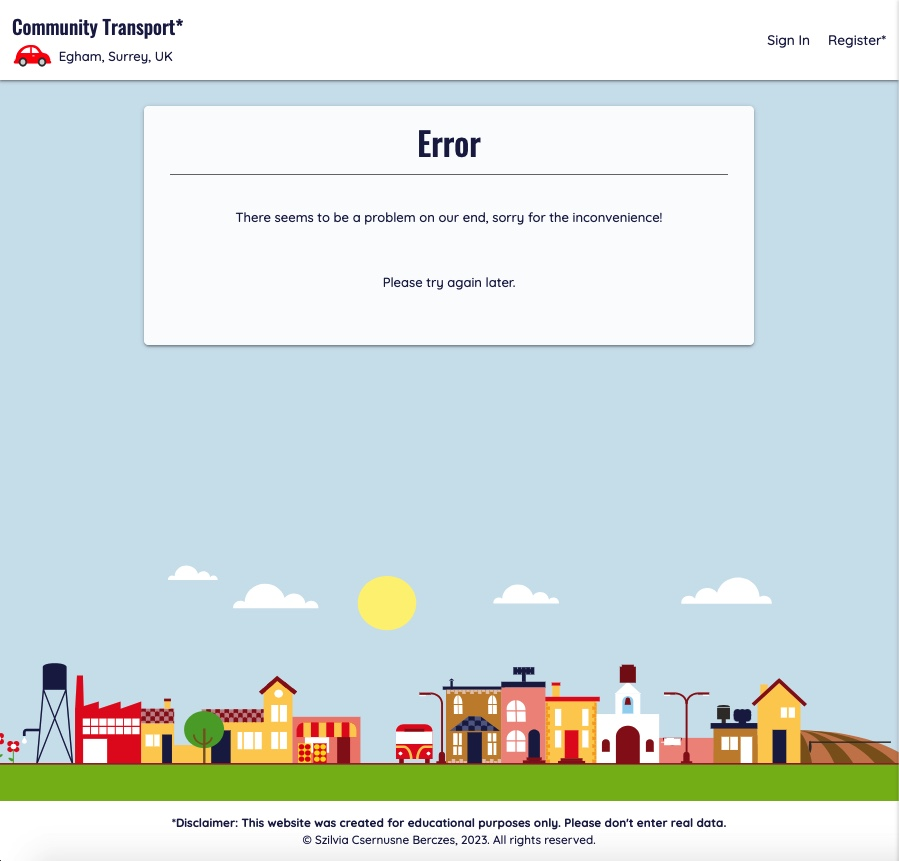

# Community Transport

Full stack web application to support the local community of Egham, UK. The app allows volunteers to sign up to offer transport to essential places such as hospitals or GP Practices. People who need such help can also sign up and request lifts. It is the Admin(s) responsibility to do background checks before they approve anybody who joins to ensure everybody's safety.

---

### [View the live project here](https://community-transport-egham.herokuapp.com/)
---


> This project was created for [Code Institute](www.codeintitute.net)'s Web Development Course as the Third Milestone Project (MS3) - Data Centric App Development Project - for assessment purposes.
    
Not for public use.
    
&copy; 2023 Szilvia Csernusne Berczes. All rights reserved.

---
  

# User Experience (UX)

## Site Owner's Goals

* Provide a platform for people willing to take part in this initiative. Users should include admins, volunteers as well as people requiring transport.
* Allow signing up as someone seeking help with transport in the local area.
* Allow signing up as a potential volunteer.
* Let admin(s) control who can be accepted to join and manage all their data.
* Provide authentication for users.
* The site should serve all types of users' goals: admins, volunteers and members.
* The site should be easily accessible from a variety of devices.
    

## Admin's Goals

As an admin, I would like to

* be able to register and safely sign in.
* have control over accepting / declining newly registered users.
* have a record of each individual.
* be able to edit the relevant records of any user.
* be able to delete any user from the database.
* be able to grant admin / volunteer privileges to other users.
* be able to take away admin / volunteer privileges from other users.
* have an overview of all current and past transport requests, except the deleted ones.
* be able to delete my own record without a trace.
    

## Member's Goals

As a member, I would like to

* be able to register and safely sign in.
* be able to edit my own data.
* be able to request a new transport.
* be able to see my current / past transport requests.
* know if a volunteer offered transport to any of my requests.
* be able to cancel any of my current requests that are due later than within 24 hours or has no volunteer.
* get a notification if I intend to cancel a request within 24 hours that already has a volunteer.
* be able to clear any of my past requests.
* be able to delete my own record without a trace.
    

## Volunteer's Goals

As a volunteer, I would like to

* be able to register and safely sign in.
* be able to edit my own data.
* be able to view all current outstanding transport requests.
* be able to accept a transport request.
* have an overview of all of the trips I previously accepted.
* be able to cancel any current trips I previously accepted.
* be able to delete my own record without a trace.

    

# Wireframes
  

Wireframes were created in [Balsamiq](https://balsamiq.cloud/).   

  
  
  
  
  
    

## Colour Scheme

Colour Palette was created using [Figma](https://www.figma.com/).

The colours were sampled from the background image. Dark red was used for admin pages and delete buttons, green was used for volunteer pages as well as volunteer actions. The general font colour is dark blue. All font colours were tested for contrast against their backgrounds.


    

## Typography

I used two fonts, [Oswald](https://fonts.google.com/specimen/Oswald) and [Quicksand](https://fonts.google.com/specimen/Quicksand) from the [Google Fonts](https://fonts.google.com/) library. I selected them because I felt that they complement each other and their styles are fitting the scheme.
    


## Imagery

The main background image was downloaded from [freesvg.org](https://freesvg.org/cityscape-cartoon-illustration).

The icons were downloaded from [svgrepo](https://svgrepo.com/). Credits to individual icons are given in the [credits](#credits) section.   
For **favicons**, I created a small logo in [Figma](https://www.figma.com/) and used the [RealFaviconGenerator](https://realfavicongenerator.net/svg-favicon/) to convert it to favicons.

    

# Database

Four tables were used to model the data and its relationships.


  

[Schema Link (accessible for LucidChart users)](https://lucid.app/lucidchart/55d32dd7-0602-401b-8492-4d5bce45d4cb/edit?viewport_loc=-34%2C-1175%2C2263%2C1092%2C0_0&invitationId=inv_b0df2289-d582-4b8f-8740-c7cafb034218)

# Functionality

## Landing Page


The landing page gives a small intro about the organisation's mission and ways to sign up as a volunteer or as someone seeking help. 

### Features

* I animated the background image and the red car in the front in CSS to give the impression of the car moving forward. 
* I drew the red car in [Figma](https://www.figma.com/) by copying this [free image](https://www.cleanpng.com/png-car-ferrari-f50-honda-civic-clip-art-red-car-clipa-178920/download-png.html). I needed to separate the car's body from its wheels in order to animate them separately.
* The responsible navbar is a [Materialize](https://materializecss.com/) feature.
* The background picture is downloaded from [freesvg.org](https://freesvg.org/cityscape-cartoon-illustration) 

 ---
    

## Registration

People can register for this project by filling in a registration form. However, submitting the form does not give automatic access to the site - an admin is required to approve everyone.


### Validation

Javascript was used throughout for frontend validation. For name, phone number, email and password, `Regular Expressions (Regex)` was used.  

* Name input is being verified to have only characters with the length of 5-30.  
   

* Phone number is being verified to be a UK phone number without space characters.  
   

* I used the [Google Maps API](https://developers.google.com/maps)'s Autocomplete service in JavaScript to validate the address input. The user has to choose an address from the suggested list otherwise it gives an error message. I also restricted the available addresses to Egham and its neighbouring areas.  
  
  

* Phone number has to be a UK phone number without space characters.  
   

* Email has to have the correct format.  
   

* Password is also restricted to be a regular 'strong' password. An error message notifies the user if the requirements haven't been met.  
  

  

After Successfully submitting the form, the user receives a flash notification:  

  

After submission, the email's uniqueness is verified on the backend.  
If the email was already registered, it gives a feedback:  

  


  
 ---
    

## Sign in

Without an admin's approval, a newly registered person can't sign in, they get a notification if they try to:
  


After having been approved, a registered person can sign in.


  

If the email or password was incorrect, user gets an error:


  

Otherwise, the user gets logged in and is greeted with a welcome message:


  
 ---
    


## New Request

The new transport request form is pre-populated with the user's home address for convenience, but it also can be changed if the pickup address is different. Both addresses need to be Google-verified addresses, with the same validation process as for the registration form. The date input is restricted to the next 3 months.


  

The date- and time inputs are Materialize features:


  

Upon submission, I validate all input again with JavaScript. I restricted Materialize's date picker to the next three months but I validate all input once again to make sure the user didn't entered any wrong data manually.


  

If all data is valid, the request gets registered and the user receives a feedback:


  
 ---
    

## My Requests 

The user can keep track of their requests in the `My Requests` page.

Here, we can see Ethan's newly registered requests. The first request opens automatically and a map shows the route of the requested trip. It calculates the distance and the approx. time of travel. There is an option to Cancel this request too. The reason why just the first request is rendered with a map is that the Google Map API is a paid for service and rendering a map for all requests would quickly multiply the costs.


  

If a volunteer accepts this request, the state of the request changes to `Arranged` and the volunteer's contact details will be visible on the page.


  

If the user wants to cancel the request within 24 hours of the pickup time, their request will be denied with a notification:


  
 ---
    

## Outstanding Requests and Arranged Trips (seen by volunteers)

Volunteers can see all upcoming requests that nobody volunteered for yet in the `Outstanding Requests` tab. The first such request is provided with a map and a route as well as all details necessary.  The reason behind rendering a map to the first trip only is the same as for the `My Requests` page.   
 With the `Accept Transport Request` button, the volunteer can take on this transport.


After accepting a request, the user will be taken to the `Trips` page, where they can keep track all of their upcoming trips they have volunteered for.
The first such trip is provided with a map and a route as well as all details necessary. The reason behind rendering a map to the first trip only is the same as for the `My Requests` page.  


The volunteer can cancel the trip anytime, in which case another volunteer can still pick up the request. However, if the cancellation time is within 24 hours of the pickup time, they get a notification to get in touch with this individual personally.


  
 ---
    


## All Members (seen by admins)

If an admin logs in, they are taken to the admin's platform. One of the admin functions is `All Users`: an admin can see, approve, edit and delete any user. They can grant and take away admin privileges as well as volunteer roles.


Approval

Any Admin can approve a new person. They can review the request by contacting this person and having checks carried out before they approve them in the system.
If there are new people awaiting approval, they appear under the `All Users` tab.
The platform gives indications about how many new people there are as well as if they signed up as a volunteer or just as a simple member.


  


Superuser is the first admin to the site. It can give admin privileges to others that have all the same rights as the Superuser except that Superuser can't be deleted or its admin status taken away. This is to ensure that one cannot accidentally delete all admins from the site.

  
 ---
    

## All Requests (seen by admins)

The other main admin function is monitoring all transport requests under the `All Requests` tab. After successful login, this is the page where the admin is directed to. The page lists all upcoming and past requests, ordered by their pickup dates and times. The map shows all current requests' pickup places with clustered map markers, centered around the first request.
  


 ---
    

## Profile Page / Edit Profile

All types of users have slightly different profile page.


The `Update User` page can be accessed from many channels throughout the website, they all land in this shared page:


  
---

## Confirmation Messages

Whenever the user is about to take a distructive action, a modal is rendered to ask for confirmation.
* Signing Out via clicking the Logo:  
  
* Cancelling a transport offer by the volunteer:  
  
* Cancelling a transport request by the member:  
  
* Member deleting their own record:  
 
* Deleting a volunteer by an admin:  
   
* Deleting an admin by another admin:  
  


## Deletion of records

As there are many types of relationships among the tables, the database's integrity needed to be preserved when deleting data.

* When a trip gets cancelled by a volunteer, the transport request's state will turn to `Awaiting Volunteer` again.
* When a request gets cancelled by the member, the request will not show up anymore among the volunteer's trips if it was previously accepted.
* When a member gets deleted, all their requests will be deleted too.
* When a volunteer gets deleted, all the trips they volunteered for will turn back to `Awaiting Volunteer` state.
* When an admin gets deleted, all other people who were approved by this admin upon registration need re-approval by another admin. This also means that these people can not access their account until this re-approval happens.


## Error pages

Two types of error messages can be delivered to the user depending on the issue 
* a `404 (not found) page` in case of an invalid URL was typed in or
* a `500 (internal server error)` in case there is a problem with code execution or with the connection to the server. 
  




    
 ---

## Future Implementations

* Email Confirmation and 'Forgot Password?' functionality

* Including Messages functions, so that people can get in touch with each other within the app.

* Including optional GPS tracking to allow seeing drivers in Uber-style live view.

* Including search options as well as paginations for the case the records grow significantly.

* Collecting more data about the trips and make them available for the admins in the form of charts and diagrams.


---

## Accessibility
  
For details on Accessibility, please refer to the [TESTING.md](TESTING.md#accessibility) file.    

---

# Technologies Used
  

## Languages Used
  

The site was built with Python, PosgreSQL, JavaScript, HTML and CSS.
    

## Frameworks, Libraries and APIs
  

* [Flask]() - Fullstack framework

* [SQLAlchemy]() - Object Relational Model to the ProsgreSQL database

* [jinja2]() - to include python code into HTML

* [Materialize](https://materializecss.com/) - Navbar, Collapsible, Form, Date and Time pickers.

* [Google Maps API](https://developers.google.com/maps) - Autocompletion, Direction, Geocoding, ClusterMarker and Map.


## Other Programs Used

* [Heroku](https://heroku.com/) - to deploy the project.

* [ElephantSQL](https://elephantsql.com/) - to deploy the database.

* [Google Fonts](https://fonts.google.com/)  - for texts.

* [Balsamiq](https://balsamiq.cloud/)  - to create wireframes.

* [Figma](https://www.figma.com/)  - to create colour palette and drawing of red car.

* [RealFaviconGenerator](https://realfavicongenerator.net/svg-favicon/)  - to generate favicons.

* [Multi Device Website Mockup](https://techsini.com/multi-mockup/index.php)  - to create site visuals for responsive design.

* [Git](https://git-scm.com/) & [Github](https://github.com/)  - for version control, safe storage and deployment.

* [Google Dev Tools](https://developer.chrome.com/docs/devtools/)  - for testing and troubleshooting.

* [Lucid App](https://lucid.app) - for database model visuals.

* [Random Key Generator](https://randomkeygen.com/) - to generate a secret key.

* [Geolocation coordinate finder](http://bboxfinder.com/) - to define the boundary box around Egham.

* [Regex testing](https://regexr.com/) - for Regular Expressions used for validations.


---

# Local Development and Deployment

## Local Development

To develop this project locally in VSCode, you need to do the followings.    

1. Make sure you have python installed.
2. Clone this project into a new repository.
3. Create a folder named `.venv`.
4. Run `pipenv install 'Flask-SQLAlchemy<3' psycopg2 sqlalchemy=1.4.46 pep8 autopep8 pylint pylint-flask` - after executing this command, the `.venv` folder should be populated.
5. Reload VSCode window.
6. Run `pipenv shell` to enter the virtual environment - if your prompt starts with `(community-transport)`, you are successfully iside the virtual environment.
7. Create your own `env.py` file as mine was not pushed to Github. In your `.gitignore` file, you should list `env.py` so your secrets will not be revealed in your GitHub repo. In the `env.py` file, specify the followings:

    ```python
    import os

    os.environ.setdefault("IP", "0.0.0.0")
    os.environ.setdefault("PORT", "5000")
    os.environ.setdefault("SECRET_KEY", "your-secret-key")
    os.environ.setdefault("DEBUG", "True")
    os.environ.setdefault("DEVELOPMENT", "True")
    os.environ.setdefault("DB_URL", "postgresql:///commtransport")
    os.environ.setdefault("GOOGLE_MAPS_KEY", 'your-google-maps-api')
    ```

8. Create the database locally:
    - In the terminal, run:
    ```
    psql
    CREATE DATABASE commtransport;
    \c commtransport;
    \q
    ```
9. Set up the Model structure with the schema:
    - in the terminal, run:
    ```
    python3
    from commtransport import db
    db.create_all()
    exit()

    ```

10. To confirm that the migration was successful:
    ```
    psql -d commtransport
    \dt
    ```
    This should have listed all model tables.
    ```
    \q
    ```

11. To run the project on the local development server:
    ```
    python3 run.py
    ```

  
 ---
  

## Deployment

To deploy this project, I took the following steps:

1. I ran `pip freeze --local > requirement.txt`
2. Created the `Procfile`.
3. In my `__init__.py` file, I added the contitional database environment url code (lines 11-17).
4. Pushed the changes to GitHub.

In ElephantSQL,
1. I created a new Instance (database) in ElephantSQL. 
2. I copied the instance URL to the clipboard.

In Heroku,
1. Created a new project.
2. In the new project's settings, I set the `Config Vars`
    ```
    DATABASE_URL  -- the ElephantSQL link comes here
    IP -- 0.0.0.0
    PORT -- 5000
    SECRET_KEY -- my-secret-key
    DEBUG -- True
    ```
    The DEBUG setting was true only while I was developing the project. I deleted this variable before I submitted this project.
3. Deploy / GitHub, connected my repo.
4. Enabled Continous Integration - this made sure every new push to the GitHub repository was deployed.
5. Open app / More / Run Console:
    ```
    python3
    from commtransport import db
    db.create_all()
    exit()

    ```

In both the local development environment and the deployed database, I first created the Superuser as the first user of the site. I had to manually give Superuser the superpowers by executing SQL commands. The program is designed such that only an admin can approve any person joining the site so the first person has to be "approved" outside the normal ways. Both in the local postgresql database or in ElephantSQL, I had to run the followings:
```
UPDATE member SET is_admin=True, approved=True WHERE id=1;
UPDATE approval SET status='approved' WHERE id=1;
``` 

    


# Testing

Please refer to [TESTING.md](TESTING.md) for detailed testing documentation.

---
    

# Credits

  

## Imagery
  

* background image 
https://freesvg.org/cityscape-cartoon-illustration - PD (Public Domain) Licence 

* logout svg icon
https://www.svgrepo.com/svg/499618/logout - PD (Public Domain) Licence

* user icon
https://www.svgrepo.com/svg/499663/user - PD (Public Domain) Licence

* calendar icon
https://www.svgrepo.com/svg/499578/calendar - PD (Public Domain) Licence

* house icon
https://www.svgrepo.com/svg/499611/home - PD (Public Domain) Licence

* location icon
https://www.svgrepo.com/svg/499616/location - PD (Public Domain) Licence

* phone icon
https://www.svgrepo.com/svg/499633/phone - PD (Public Domain) Licence

* mail icon
https://www.svgrepo.com/svg/499621/mail - PD (Public Domain) Licence

* edit icon
https://www.svgrepo.com/svg/499600/edit - PD (Public Domain) Licence

* user-remove icon
https://www.svgrepo.com/svg/499667/user-remove - PD (Public Domain) Licence

* lock icon
https://www.svgrepo.com/svg/499617/lock - PD (Public Domain) Licence

* clock icon
https://www.svgrepo.com/svg/499655/time - PD (Public Domain) Licence

* login icon
https://www.svgrepo.com/svg/499619/login - PD (Public Domain) Licence

* burger icon
https://www.svgrepo.com/svg/499620/menu-burger - PD (Public Domain) Licence

* caret down
https://www.svgrepo.com/svg/499575/chevron-down - PD (Public Domain) Licence

    

## Incorporated ideas and solutions
  

* user login model (used as a starter code)
https://github.com/Code-Institute-Solutions/CombinedTaskManager2022/tree/main

* password validation regex (used as a starter code)
https://stackoverflow.com/questions/19605150/regex-for-password-must-contain-at-least-eight-characters-at-least-one-number-a

* red car icon (own drawing after this picture)
https://www.cleanpng.com/png-car-ferrari-f50-honda-civic-clip-art-red-car-clipa-178920/download-png.html

* animation inspiration:
https://developer.mozilla.org/en-US/docs/Web/CSS/transform
https://developer.mozilla.org/en-US/docs/Web/CSS/animation

    


##  Acknowledgements
  
I would like to thank the following contributors:

* My mentors, [David Bowers](https://github.com/dnlbowers/) and [Elaine Broche](https://github.com/elainebroche-dev), as well as my college coordinator [Manuel Perez Romero](https://www.linkedin.com/in/manuel-perez-romero-460063176/) for giving useful feedback throughout the development and testing processes.

* My family and friends for taking the time to test the site.

* [Code Institute](www.codeintitute.net)'s Slack Community for continuous support.

    


##  Disclaimer
  

This project was created for Code Institute's web application development course as the Third Milestone Project - Data Centric Fullstack Development Project - for assessment purposes. All parts of the project form the intellectual property of the developer.
    
Not for public use.
    
&copy;2023 Szilvia Csernusne Berczes. All rights reserved. 