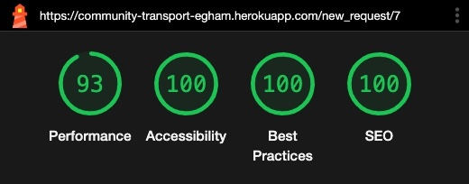
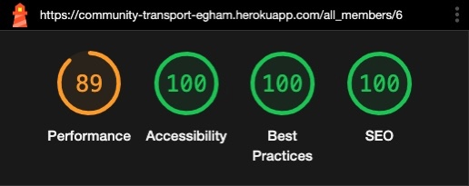

# TESTING - Community Transport project 

## Validation

### Python Validation

Validator: https://pep8ci.herokuapp.com/

| CI Python Linter Result | Passed |Warnings | 
| :--- | :---: | :--- | 
| [models.py file CI Linter Result](testing-images/python-models-py.jpeg) | &check; | |
| [routes.py file CI Linter Result](testing-images/python-routes-py.jpeg) | &check; | The Linter warnings refer to SQL Alchemy database queries that would not work with the suggested corrections.|

    

### JavaScript Validations

Validator: https://jshint.com/

| JSHint Result | Passed | Warnings |
| :--- | :---: | :--- | 
| [general.js file JSHint Result](testing-images/jshint-general-js.jpeg)| &check; | ES11 features were flagged due to JSHint testing code against ES6.  `M` variable is defined by Materialize. |
| [password_validation.js file JSHint Result](testing-images/jshint-password_validation-js.jpeg)| &check; |  No warnings. |
| [new_req_form_validation.js file JSHint Result](testing-images/jshint-new_req_form_validation-js.jpeg)| &check;| No warnings. |
| [new_req_addr_validation.js file JSHint Result](testing-images/jshint-new_req_addr_validation-js.jpeg)| &check;| ES8 and ES11 features were flagged due to JSHint testing code against ES6.  `google` variable is defined by Google. |
| [reg_form_validation.js file JSHint Result](testing-images/jshint-reg_form_validation-js.jpeg)| &check;|  No warnings. |
| [reg_addr_validation.js file JSHint Result](testing-images/jshint-reg_addr_validation-js.jpeg)| &check;| ES8 and ES11 features were flagged due to JSHint testing code against ES6. `google` variable is defined by Google. |
| [edit_member_form_validation.js file JSHint Result](testing-images/jshint-edit_member_form_validation-js.jpeg)| &check;| No warnings. |
| [edit_member_addr_validation.js file JSHint Result](testing-images/jshint-edit_member_addr_validation-js.jpeg)| &check;| ES8 and ES11 features were flagged due to JSHint testing code against ES6.  `google` variable is defined by Google. |
| [trip_map.js file JSHint Result](testing-images/jshint-trip_map-js.jpeg)| &check;| `google` variable is defined by Google. |
| [cluster_trips_map.js file JSHint Result](testing-images/jshint-cluster_trips_map-js.jpeg)| &check;| ES8 features were flagged due to JSHint testing code against ES6.  `google` and `markerClusterer` variables are defined by Google.  `markerCluster` variable definition is the recommended way of usage. (Using `new` without a variable would be unsafe.) |
| [datetime_validation.js file JSHint Result](testing-images/jshint-datetime_validation-js.jpeg)| &check;| No warnings. |
| [validation_helper.js file JSHint Result](testing-images/jshint-validation_helper-js.jpeg)| &check;| No warnings. |
| [name_validation.js file JSHint Result](testing-images/jshint-name-validation-js.jpeg)| &check;| No warnings. |
| [phone_validation.js file JSHint Result](testing-images/jshint-phone-validation-js.jpeg)| &check;| No warnings. |
| [email_validation.js file JSHint Result](testing-images/jshint-email-validation-js.jpeg)| &check;| No warnings. |

    

### HTML and CSS Validations

Validator: https://validator.w3.org/

> Please note that all the HTML validations' result looks the same, so I included only one screenshot under the `Home` Page.
> CSS Errors can be ignored as they are referring to new CSS properties (translate, scale, rotate) that are now widely supported.

| W3C Result | Passed |
| :--- | :---: | 
| [`Home`](testing-images/ww3c-home.jpeg) Page | &check; |
| `Register` Page | &check; |
| `Sign In` Page | &check; |
| `Member Profile` Page | &check; |
| `My Requests` Page | &check; |
| `New Request` Page | &check; |
| `Admin Profile` Page | &check; |
| `All Users` Page | &check; |
| `All Requests` Page | &check; |
| `Volunteer Profile` Page | &check; |
| `Outstanding Requests` Page | &check; |
| `Trips` Page | &check; |
| `Update User` Page | &check; |
| `404` Page | &check; |
| `500` Page | &check; |
| [style.css file validation](testing-images/w3c-style-css.jpeg) | &check; |

    

# Testing User Stories

Tests were carried out on Chrome 111.0.5563.110  
(macOS Catalina v10.15.7)

## Site Owner's Goals

| Passed | Site Owneer's Goals
| :--: | :-- |
|  |  **...provide a platform for people willing to take part in this initiative** |
| &check; | The homepage effectively describes who this website is created for. |
| &check; | It allows any individuals to register their interest. |
|  |  **...allow signing up as someone seeking help with transport in the local area.** |
| &check; | The site allows vulnerable individuals to sign up. |
|  |  **...allow signing up as a potential volunteer.** |
| &check; | There is a dedicated link for volunteers to sign up. |
| &check; | The volunteer can sign up normally as well, then the admin can mark them as volunteers later. |
|  |  **...let admin(s) control who can be accepted to join and manage all their data.** |
| &check; | Admin(s) can approve new members. |
| &check; | Admin(s) can mark anyone as a volunteer. |
| &check; | Admin(s) can mark anyone as an admin. |
| &check; | Admin(s) can edit any member's relevant data. |
| &check; | Admin(s) can delete any users. |
|  |  **...provide authentication for users.** |
| &check; | Without registration, there is no access to the site beyond the home page. |
| &check; | People can register with a safe password. |
| &check; | People can sign in. |
| &check; | People can retain their signed in status until signout or closing the browser tab. |
| &check; | People can sign out. |
|| **...the site should serve all types of users' goals: admins, volunteers and members.**|
| &check; | Detailed admin goals testing shows that the site serves their purpose. See results below. |
| &check; | Detailed volunteer goals testing shows that the site serves their purpose. See results below. |
| &check; | Detailed member goals testing shows that the site serves their purpose. See results below. |
|| **...the site should be easily accessible from a variety of devices.**|
| &check; | The site was thoroughly tested for responsiveness. See results below. |
| &check; | Accessibility was tested with Lighthouse. See results below. |

    

## Admin's Goals

| Passed | Admin's Goals
| :--: | :-- |
|  |  **...be able to register and safely sign in.** |
| &check; | The user can sign up as anyone else, then another admin can grant them admin rights. |
| &check; | After approval, admin can sign in with their username and password. |
|  |  **...have control over accepting / declining newly registered users.** |
| &check; | The `All Users` page provides platform for approving new members. |
| &check; | The `All Users` page provides platform for deleting newly registered people without approving them first. |
|  |  **...have a record of each individual.** |
| &check; | The `All Users` page provides list for all users. |
| &check; | Every users' detailed record is accessible for the admin. |
|  |  **...be able to edit the relevant records of any user.** |
| &check; | The `All Users` page provides access to edit any users' relevant data. |
|  |  **...be able to delete any user from the database.** |
| &check; | Admin has access to deleting any users from the database. (Except Superuser) |
|  |  **...be able to grant admin / volunteer privileges to other users.** |
| &check; | Admin can grant admin rights to any user. |
| &check; | Admin can grant volunteer rights to any user. (Except Superuser) |
|  |  **...be able to take away admin / volunteer privileges to other users.** |
| &check; | Admin can take away admin rights from any user. (Except from Superuser)|
| &check; | Admin can take away volunteer rights to any user.|
|  |  **...have an overview of all current and past transport requests.** |
| &check; | Admin can see any Current requests under the `All Requests` tab.|
| &check; | Admin can see any Past requests under the `All Requests` tab.|
| &check; | Admin can not see any Deleted requests or any previously deleted user's requests.|
|  |  **...be able to delete my own record without a trace.** |
| &check; | Admin can delete himself/herself from the database through either their own profile page or from the `All Users` page.|
| &check; | All the users that he/she approved before, will turn into 'unapproved' status.|
| &check; | User will have no access to the site anymore.|

## Member's Goals

| Passed | Member's Goals
| :--: | :-- |
|  |  **...be able to register and safely sign in.** |
| &check; | The user can sign up as anyone else, then another admin can approve their registration. |
| &check; | After approval, user can sign in with their username and password. |
|  |  **...be able to edit my own data.** |
| &check; | User can access their personal data through their `Profile` page. |
| &check; | They can update their name, phone number and address. |
|  |  **...be able to request a new transport.** |
| &check; | User can request a lift through the `New Request tab` or `New Request button` on the `My Requests` page. |
|  |  **...be able to see my current / past transport requests.** |
| &check; | User can view all their current requests under the `My Requests` page. |
| &check; | User can view all their past requests under the `My Requests` page. |
|  |  **...know if a volunteer offered transport to any of my requests.** |
| &check; | User can see if their request was accepted when the request's mark turns to `Arranged`.|
| &check; | The request's details also shows the Volunteer's name and contact details.|
|  |  **...be able to cancel any of my current requests that are due later than within 24 hours or has no volunteer.** |
| &check; | User is provided with a `Cancel Request` button through which they can delete any open requests.|
| &check; | User can delete any requests that are due later than one day.|
|  |  **...get a notification if I intend to cancel a request within 24 hours that already has a volunteer..** |
| &check; | Those requests that have volunteer offers and are within 24 hours, cancellation is denied with a notification.|
|  |  **...be able to clear any of my past requests.** |
| &check; | User is provided with a `Clear` button, through which they can delete any past requests.|
|  |  **...be able to delete my own record without a trace.** |
| &check; | User can delete himself/herself from the database through their `Profile` page or `Update User` page.|
| &check; | All their requests will also be deleted.|
| &check; | User will have no access to the site anymore.|

    

## Volunteer's Goals

| Passed | Volunteer's Goals
| :--: | :-- |
|  |  **...be able to register and safely sign in.** |
| &check; | User can sign up specifically as a volunteer. |
| &check; | User can sign up as anyone else, then another admin can mark them as a volunteer. |
| &check; | After approval, user can sign in with their username and password. |
|  |  **...be able to edit my own data.** |
| &check; | User can access their personal data through their `Profile` page. |
| &check; | They can update their name, phone number and address. |
|  |  **...be able to view all current outstanding transport requests.** |
| &check; | Volunteer can view all current requests under the `Outstanding Requests` tab. |
|  |  **...be able to accept a transport request.** |
| &check; | Volunteer is provided with an `Accept Transport Request` button through which they can sign up for any open requests. |
|  |  **...have an overview of all of the trips I previously accepted.** |
| &check; | Volunteer can see all the trips they have volunteered for under the `Trips` tab.|
|  |  **...be able to cancel any current trips I previously accepted.** |
| &check; | Volunteer is provided with a `Cancel` button through which they can delete any open requests.|
| &check; | The request's status turns back to `Awaiting volunteer` and any other volunteer can accept it again.|
|  |  **...be able to delete my own record without a trace.** |
| &check; | User can delete himself/herself from the database through their `Profile` page or `Update User` page.|
| &check; | All the trips they have previously volunteered for will change back to `Awaiting volunteer` status.|
| &check; | User will have no access to the site anymore.|

    

# Accessibility
  

* Images have `alt` labels. 
* Icons that have inferred meanings are marked with `aria` labels.
* For font sizes, `rem` was used throughout the site to allow the text to scale according to the users' preferred default font size.
* Semantic HTML was used.
* All colours were tested for contrast in Chrome's Dev Tools.
* Chrome Dev Tools' Lighthouse score is 100% for accessibility for both mobile and desktop devices. (See below.)
* `WAVE` Accessibility checker was also used to check all the pages. One issue was flagged on every page where a map rendered, stating that 'the map area is missing alternative text'. This piece of code is beyond my control, it's controlled by the Google Maps API. The underlying cause is that rendered Google Maps are not accessible for visually impared users. However, in my case, I included both addresses in written form as well so the screen readers would access all the information.

    
 ---

 # Manual Testing

Tests were carried out on Chrome 111.0.5563.110  
(macOS Catalina v10.15.7)

For detailed manual testing, please refer to this document:  

Manual Test Cases

  
  

# Responsiveness Testing

Responsiveness was tested using [Google Dev Tools](https://developer.chrome.com/docs/devtools/)  
Browser & Version: Chrome 111.0.5563.110 (on Desktop, macOS Catalina version 10.15.7)
    

| Device | Home | Register | Login | All Members | All Requests | Admin Profile |Outstanding Requests|Volunteer Trips|Volunteer Profile| Member Profile |New Request| Edit Member |
| :--- | :---: | :---: | :---: | :---: | :---: | :---: | :---: | :---: | :---: | :---: | :---: | :---: |
| iPhone SE  | &check; | &check; | &check; | &check; | &check; | &check; | &check; | &check; | &check; | &check; | &check; | &check; |
| iPhone XR | &check; | &check; | &check; | &check; | &check; | &check; | &check; | &check; | &check; | &check; | &check; | &check; |
| iPhone 12 Pro | &check; | &check; | &check; | &check; | &check; | &check; | &check; | &check; | &check; | &check; | &check; | &check; |
| Pixel 5 | &check; | &check; | &check; | &check; | &check; | &check; | &check; | &check; | &check; | &check; | &check; | &check; |
| Samsung Galaxy S8+ |&check; | &check; | &check; | &check; | &check; | &check; | &check; | &check; | &check; | &check; | &check; | &check; |
| Samsung Galaxy S20 Ultra | &check; | &check; | &check; | &check; | &check; | &check; | &check; | &check; | &check; | &check; | &check; | &check; |
| iPad Air | &check; | &check; | &check; | &check; | &check; | &check; | &check; | &check; | &check; | &check; | &check; | &check; |
| iPad Mini | &check; | &check; | &check; | &check; | &check; | &check; | &check; | &check; | &check; | &check; | &check; | &check; |
| Surface Pro 7 | &check; | &check; | &check; | &check; | &check; | &check; | &check; | &check; | &check; | &check; | &check; | &check; |
| Samsung Galaxy A51/71 | &check; | &check; | &check; | &check; | &check; | &check; | &check; | &check; | &check; | &check; | &check; | &check; |
| Nest Hub | &check; | &check; | &check; | &check; | &check; | &check; | &check; | &check; | &check; | &check; | &check; | &check; |
| Nest Hub Max | &check; | &check; | &check; | &check; | &check; | &check; | &check; | &check; | &check; | &check; | &check; | &check; |

    

# Lighthouse tests

Performance, Accessibility, Best Practices and SEO tests were carried out with [Google Dev Tools](https://developer.chrome.com/docs/devtools/)' **Lighthouse** tool in `Incognito` mode. Results are not 100% consistent, there is always a few percent variation at each performed test.

| Page | Device  | Result | Note |
| :--: | :-----: | :----: | :--- |
| home | desktop |  ||
|      | mobile  |  ||
| registration | desktop |  ||
|      | mobile  |  ||
| signin | desktop |  ||
|      | mobile  |  ||
| member requests | desktop |  |The lower performance is caused by the Google Maps API's slow response time.   The lower Best Practices score is due to the Goggle Map Marker's low resolution picture.|
|      | mobile  |  |The lower performance is caused by the Google Maps API's slow response time.    The lower Best Practices score is due to the Goggle Map Marker's low resolution picture, the lower SEO score to the difficult-to-tap small prints on the map.|
| new request | desktop |  ||
|      | mobile  |  ||
| member profile | desktop |  ||
|      | mobile  |  ||
| volunteer requests | desktop |  |The lower performance is caused by the Google Maps API's slow response time.   The lower Best Practices score is due to the Goggle Map Marker's low resolution picture.|
|      | mobile  |  |The lower performance is caused by the Google Maps API's slow response time.    The lower Best Practices score is due to the Goggle Map Marker's low resolution picture, the lower SEO score to the difficult-to-tap small prints on the map.|
| volunteer trips | desktop |  |The lower performance is caused by the Google Maps API's slow response time.   The lower Best Practices score is due to the Goggle Map Marker's low resolution picture.|
|      | mobile  |  |The lower performance is caused by the Google Maps API's slow response time.   The lower Best Practices score is due to the Goggle Map Marker's low resolution picture, the lower SEO score to the difficult-to-tap small prints on the map.|
| volunteer profile | desktop |  ||
|      | mobile  |  ||
| all members | desktop |  ||
|      | mobile  |  ||
| all requests | desktop |  |The lower Best Practices score is due to the Goggle Map Marker's low resolution picture.|
|      | mobile  |  |The lower Best Practices score is due to the Goggle Map Marker's low resolution picture, the lower SEO score to the difficult-to-tap small prints on the map.|
| admin profile | desktop |  ||
|      | mobile  |  ||

---

# Resolved bugs - discovered during Testing

* Colour contrast issue for the form labels.
    - Solution: As these labels are Materialize features, I had to modify Materialize classes.
* The notification for cancelling a trip that is too close to the due time was not appearing.
    - Solution: The cause was that I used the `datetime.utcnow()` function for the current time. I corrected it to `datetime.now()` that takes the current timezone as well as the summertime calculations into account.
* Validation testing flagged that my 'flash' messages were in a `section` without a header. These flash messages didn't need a header so I changed `section` to `div`.
* Error Pages missed the link to Home page from the Logo. - Rectified.
* A `rem` unit was missing from the `my-small-icon`'s margin. - Rectified.
* A number of semicolons were missing from my javascript files. - Rectified.
* Lot of extra whitespaces as well as long rows were present in my python files. - Rectified.

    

# Bugs

* Address label on google address autocomplete fields are in "active" state, even when there hasn't been any activity in that field. 
    - The reason behind this is that the Google Autocomplete API 'listens' to this field and that triggers the active status. In order to make this field look the same as the other fields, I should not use Materialize for forms. This solution would be disproportionate compared to the issue, so I decided to leave it for now.
* On one occasion, there was a console error after I selected an address offered by Autocomplete. It didn't get through my JS validation either, unless I chose another address.
    - The error was coming from the Google Maps API, complaining about the place not having an ID. I concluded, that this must be an error either with the way the autocoplete results are cached within the browser or the error is with the API itself. This issue could be investigated further.
* My mentor noticed that when he signed in on a Samsung Galaxy S20 device in the Chrome browser, received double welcome messages. 
    - This issue never happened on any of my devices. Unfortunately, I could not replicate the issue, therefore, I could not find a solution.  
    
